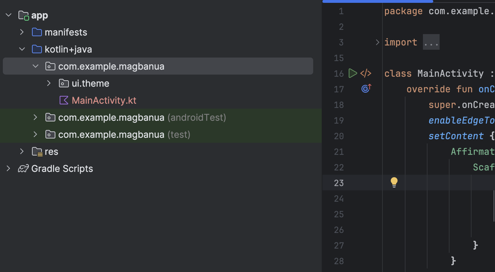

summary: Affirmation List Application
id: affirmation-application-list
categories: Android
tags: android
status: Published
authors: Ariel

# Affirmation List Application

<!-- ------------------------ -->

## Application Overview

Duration: 5

In this homework, you learn how to make a scrollable list in your app using Jetpack Compose. You will be working with the Affirmations app, which displays a list of affirmations paired with beautiful images to bring positivity to your day!

### Prerequisites

- Familiarity with lists in Kotlin
- Experience building layouts with Jetpack Compose
- Experience running apps on a device or emulator


### Starter Code

```kotlin
class MainActivity : ComponentActivity() {
    override fun onCreate(savedInstanceState: Bundle?) {
        super.onCreate(savedInstanceState)
        setContent {
            AffirmationsTheme {
                // A surface container using the 'background' color from the theme
                Surface(
                    modifier = Modifier.fillMaxSize(),
                    color = MaterialTheme.colorScheme.background
                ) {
                    AffirmationsApp()
                }
            }
        }
    }
}
```

<!-- ------------------------ -->

## Data Class For Affirmation

Duration: 30

### Create Models Package

In Android apps, lists are made up of list items. For single pieces of data, this could be something simple like a string or an integer. For list items that have multiple pieces of data, like an image and text, you will need a class that contains all of these properties. Data classes are a type of class that only contain properties, they can provide some utility methods to work with those properties.

Create a new package under **com.example.lastname**. Name the new package models. The models package will contain the data model that will be represented by a data class. The data class will be comprised of properties that represent the information relevant to what will be an "Affirmation," which will consist of a string resource and an image resource. Packages are directories that contain classes and even other directories.




### Create Affirmation Data Class

Create a new class in the **com.example.affirmations.models** package. Name the new class **Affirmation** and make it a **Data** class. Each **Affirmation** consists of one image and one string. Create two val properties in the Affirmation data class. One should be called stringResourceId and the other imageResourceId. They should both be integers.

```kotlin
data class Affirmation(
    val stringResourceId: Int,
    val imageResourceId: Int
)
```

Annotate the **stringResourceId** property with the **@StringRes** annotation and annotate the **imageResourceId** with the **@DrawableRes** annotation. The stringResourceId represents an ID for the affirmation text stored in a string resource. The imageResourceId represents an ID for the affirmation image stored in a drawable resource.

```kotlin
import androidx.annotation.DrawableRes
import androidx.annotation.StringRes

data class Affirmation(
    @StringRes val stringResourceId: Int,
    @DrawableRes val imageResourceId: Int
)
```

Create your own 10 string resources for each **Affirmation** in the **strings** resource.

```xml
<resources>
    <string name="app_name">Affirmations</string>

    <string name="affirmation1">I am strong</string>
    <string name="affirmation2">I believe in myself</string>
    <string name="affirmation3">Each day is a new opportunity to grow and be a better version of myself</string>
</resources>
```

At this point you should already familiar with adding images or **importing drawables** in your android project. If not, then review your dice roller application work as a reference on how to import your images as drawables. Choose 10 images that will represent or an inspiration for each affirmation and import them as _image1_ - _image10_.

Create the package **com.example.affirmations.data** and then create a class named **Datasource**. This class must have **loadAffirmations** which returns a list of **Affirmation data class object**. Provide the string resource id and drawable resource id for each Affirmation in the list.

```kotlin
import com.example.affirmations.R
import com.example.affirmations.model.Affirmation

class Datasource() {
    fun loadAffirmations(): List<Affirmation> {
        return listOf<Affirmation>(
            Affirmation(R.string.affirmation1, R.drawable.image1),
            Affirmation(R.string.affirmation2, R.drawable.image2),
            Affirmation(R.string.affirmation3, R.drawable.image3),
            Affirmation(R.string.affirmation4, R.drawable.image4),
            Affirmation(R.string.affirmation5, R.drawable.image5),
            Affirmation(R.string.affirmation6, R.drawable.image6),
            Affirmation(R.string.affirmation7, R.drawable.image7),
            Affirmation(R.string.affirmation8, R.drawable.image8),
            Affirmation(R.string.affirmation9, R.drawable.image9),
            Affirmation(R.string.affirmation10, R.drawable.image10)
        )
    }
}
```

<!-- ------------------------ -->

## Add a List to Your Application

Duration: 45

### Create a List item card

This app is meant to display a list of affirmations. The first step in configuring the UI to display a list is to create a list item. Each affirmation item consists of an image and a string. The data for each of these items comes with the starter code, and you will create the UI component to display such an item.

The item will be comprised of a **Card** composable, containing an **Image** and a **Text** composable. In Compose, a **Card** is a surface that displays content and actions in a single container. The Affirmation card will look like this in the preview:


The card shows an image with some text beneath it. This vertical layout can be achieved using a Column composable wrapped in a **Card** composable. You can give it a try on your own, or follow the steps below to achieve this.

1. Open the **MainActivity.kt** file.
2. Create a new method beneath the **AffirmationsApp()** method, called **AffirmationCard()**, and annotate it with the @Composable annotation.

`MainActivity.kt`

```kotlin
@Composable
fun AffirmationsApp() {
}

@Composable
fun AffirmationCard() {

}
```

3. Edit the method signature to take an **Affirmation** object as a parameter. The **Affirmation** object comes from the **model** package.

`MainActivity.kt`

```kotlin
import com.example.affirmations.model.Affirmation

@Composable
fun AffirmationCard(affirmation: Affirmation) {

}
```

4. Add a **modifier** parameter to the signature. Set a default value of **Modifier** for the parameter.

`MainActivity.kt`

```kotlin
@Composable
fun AffirmationCard(affirmation: Affirmation, modifier: Modifier = Modifier) {

}
```

5. Inside of the **AffirmationCard** method, call the **Card** composable. Pass in the **modifier** parameter.

`MainActivity.kt`

```kotlin
import androidx.compose.material3.Card

@Composable
fun AffirmationCard(affirmation: Affirmation, modifier: Modifier = Modifier) {
    Card(modifier = modifier) {

    }
}
```

6. Add a **Column** composable inside of the **Card** composable. Items within a **Column** composable arrange themselves vertically in the UI. This allows you to place an image above the associated text. Conversely, a **Row** composable arranges its contained items horizontally.

`MainActivity.kt`

```kotlin
import androidx.compose.foundation.layout.Column

@Composable
fun AffirmationCard(affirmation: Affirmation, modifier: Modifier = Modifier) {
    Card(modifier = modifier) {
        Column {

        }
    }

}
```

7. Add an **Image** composable inside of the lambda body of the **Column** composable. Recall that an **Image** composable always requires a resource to display, and a **contentDescription**. The resource should be a **painterResource** passed to the **painter** parameter. The **painterResource** method will load either vector drawables or rasterized asset formats like PNGs. Also, pass a **stringResource** for the **contentDescription** parameter.

`MainActivity.kt`

```kotlin
import androidx.compose.foundation.Image
import androidx.compose.ui.res.painterResource
import androidx.compose.ui.res.stringResource

@Composable
fun AffirmationCard(affirmation: Affirmation, modifier: Modifier = Modifier) {
    Card(modifier = modifier) {
        Column {
            Image(
                painter = painterResource(affirmation.imageResourceId),
                contentDescription = stringResource(affirmation.stringResourceId),
            )
        }
    }
}
```

8. In addition to the **painter** and **contentDescription** parameters, pass a **modifier** and a **contentScale**. A **contentScale** determines how the image should be scaled and displayed. The **Modifier** object should have the **fillMaxWidth** attribute set and a height of **194.dp**. The **contentScale** should be **ContentScale.Crop**.

`MainActivity.kt`

```kotlin
import androidx.compose.foundation.layout.fillMaxWidth
import androidx.compose.foundation.layout.height
import androidx.compose.ui.unit.dp
import androidx.compose.ui.layout.ContentScale

@Composable
fun AffirmationCard(affirmation: Affirmation, modifier: Modifier = Modifier) {
    Card(modifier = modifier) {
        Column {
            Image(
                painter = painterResource(affirmation.imageResourceId),
                contentDescription = stringResource(affirmation.stringResourceId),
                modifier = Modifier
                    .fillMaxWidth()
                    .height(194.dp),
                contentScale = ContentScale.Crop
            )
        }
    }
}
```

9. Inside of the **Column**, create a **Text** composable after the **Image** composable. Pass a **stringResource** of the **affirmation.stringResourceId** to the **text** parameter, pass a **Modifier** object with the **padding** attribute set to **16.dp**, and set a text theme by passing **MaterialTheme.typography.headlineSmall** to the **style** parameter.

`MainActivity.kt`

```kotlin
import androidx.compose.material3.Text
import androidx.compose.foundation.layout.padding
import androidx.compose.ui.platform.LocalContext

@Composable
fun AffirmationCard(affirmation: Affirmation, modifier: Modifier = Modifier) {
    Card(modifier = modifier) {
        Column {
            Image(
                painter = painterResource(affirmation.imageResourceId),
                contentDescription = stringResource(affirmation.stringResourceId),
                modifier = Modifier
                    .fillMaxWidth()
                    .height(194.dp),
                contentScale = ContentScale.Crop
            )
            Text(
                text = LocalContext.current.getString(affirmation.stringResourceId),
                modifier = Modifier.padding(16.dp),
                style = MaterialTheme.typography.headlineSmall
            )
        }
    }
}
```

### Preview the AffirmationCard Composable

The card is the core of the UI for the **Affirmations** app, and you worked hard to create it! To check that the card looks correct, you can create a composable that can be previewed without launching the entire app.

1. Create a private method called **AffirmationCardPreview()**. Annotate the method with **@Preview** and **@Composable**.

`MainActivity.kt`

```kotlin
import androidx.compose.ui.tooling.preview.Preview

@Preview
@Composable
private fun AffirmationCardPreview() {

}
```

2. Inside of the method, call the **AffirmationCard** composable, and pass it a new **Affirmation** object with the **R.string.affirmation1** string resource and the **R.drawable.image1** drawable resource passed into its constructor.

`MainActivity.kt`

```kotlin
@Preview
@Composable
private fun AffirmationCardPreview() {
    AffirmationCard(Affirmation(R.string.affirmation1, R.drawable.image1))
}
```

3. Open the **Split** tab and you will see a preview of the **AffirmationCard**. If necessary, click **Build & Refresh** in the **Design** pane to display the preview.


### Create the List

The list item component is the building block of the list. Once the list item is created, you can leverage it to make the list component itself.

1. Create a function called **AffirmationList()**, annotate it with the **@Composable** annotation, and declare a **List** of **Affirmation** objects as a parameter in the method signature.

`MainActivity.kt`

```kotlin
@Composable
fun AffirmationList(affirmationList: List<Affirmation>) {

}
```

2. Declare a **modifier** object as a parameter in the method signature with a default value of **Modifier**.

`MainActivity.kt`

```kotlin
@Composable
fun AffirmationList(affirmationList: List<Affirmation>, modifier: Modifier = Modifier) {

}
```

3. In Jetpack Compose, a scrollable list can be made using the **LazyColumn** composable. The difference between a **LazyColumn** and a **Column** is that a **Column** should be used when you have a small number of items to display, as **Compose** loads them all at once. A **Column** can only hold a predefined, or fixed, number of composables. A **LazyColumn** can add content on demand, which makes it good for long lists and particularly when the length of the list is unknown. A **LazyColumn** also provides scrolling by default, without additional code. Declare a **LazyColumn** composable inside of the **AffirmationList()** function. Pass the modifier object as an argument to the **LazyColumn**.

`MainActivity.kt`

```kotlin
import androidx.compose.foundation.lazy.LazyColumn

@Composable
fun AffirmationList(affirmationList: List<Affirmation>, modifier: Modifier = Modifier) {
    LazyColumn(modifier = modifier) {

    }
}
```

4. In the lambda body of the **LazyColumn**, call the **items()** method, and pass in the **affirmationList**. The **items()** method is how you add items to the **LazyColumn**. This method is somewhat unique to this composable, and is otherwise not a common practice for most composables.

`MainActivity.kt`

```kotlin
import androidx.compose.foundation.lazy.items

@Composable
fun AffirmationList(affirmationList: List<Affirmation>, modifier: Modifier = Modifier) {
    LazyColumn(modifier = modifier) {
        items(affirmationList) {

        }
    }
}
```

5. A call to the **items()** method requires a lambda function. In that function, specify a parameter of **affirmation** that represents one affirmation item from the **affirmationList**.

`MainActivity.kt`

```kotlin
@Composable
fun AffirmationList(affirmationList: List<Affirmation>, modifier: Modifier = Modifier) {
    LazyColumn(modifier = modifier) {
        items(affirmationList) { affirmation ->

        }
    }
}
```

6. For each affirmation in the list, call the **AffirmationCard()** composable. Pass it the **affirmation** and a **Modifier** object with the **padding** attribute set to **8.dp**.

`MainActivity.kt`

```kotlin
@Composable
fun AffirmationList(affirmationList: List<Affirmation>, modifier: Modifier = Modifier) {
    LazyColumn(modifier = modifier) {
        items(affirmationList) { affirmation ->
            AffirmationCard(
                affirmation = affirmation,
                modifier = Modifier.padding(8.dp)
            )
        }
    }
}
```

### Display the List

1. In the **AffirmationsApp** composable, retrieve the current layout directions and save them in a variable. These will be used to configure the padding later.

`MainActivity.kt`

```kotlin
import com.example.affirmations.data.Datasource

@Composable
fun AffirmationsApp() {
    val layoutDirection = LocalLayoutDirection.current
}
```

2. Now create a Surface composable. This composable will set the padding for the AffirmationsList composable.

`MainActivity.kt`

```kotlin
import com.example.affirmations.data.Datasource

@Composable
fun AffirmationsApp() {
    val layoutDirection = LocalLayoutDirection.current
    Surface() {
    }
}
```

3. Pass a **Modifier** to the **Surface** composable that fills the max width and height of its parent, sets status bar padding, and sets the start and end padding to the **layoutDirection**. Here's an example of how to translate a **LayoutDirection object into padding: **WindowInsets.safeDrawing.asPaddingValues().calculateStartPadding(layoutDirection)\*\*.

`MainActivity.kt`

```kotlin
import com.example.affirmations.data.Datasource

@Composable
fun AffirmationsApp() {
    val layoutDirection = LocalLayoutDirection.current
    Surface(
        Modifier = Modifier
        .fillMaxSize()
        .statusBarsPadding()
        .padding(
            start = WindowInsets.safeDrawing.asPaddingValues()
                    .calculateStartPadding(layoutDirection),
            end = WindowInsets.safeDrawing.asPaddingValues()
                    .calculateEndPadding(layoutDirection),
        ),
    ) {
    }
}
```

4. In the lambda for the **Surface** composable, call the **AffirmationList** composable, and pass **DataSource().loadAffirmations()** to the affirmationList parameter.

> Note: The **DataSource** class is found in the **data** package.

`MainActivity.kt`

```kotlin
import com.example.affirmations.data.Datasource

@Composable
fun AffirmationsApp() {
    val layoutDirection = LocalLayoutDirection.current
    Surface(
        Modifier = Modifier
        .fillMaxSize()
        .statusBarsPadding()
        .padding(
            start = WindowInsets.safeDrawing.asPaddingValues()
                    .calculateStartPadding(layoutDirection),
            end = WindowInsets.safeDrawing.asPaddingValues()
                    .calculateEndPadding(layoutDirection),
        ),
    ) {
        AffirmationsList(
            affirmationList = Datasource().loadAffirmations(),
        )
    }
}
```

Run the **Affirmations** app on a device or emulator and see the finished product!


<!-- ------------------------ -->

## Conclusion

You now know how to create cards, list items, and scrollable lists using Jetpack Compose! Keep in mind that these are just basic tools for creating a list. You can let your creativity roam and customize list items however you like!

### Summary

- Use [Card](<https://developer.android.com/reference/kotlin/androidx/compose/material3/package-summary#Card(androidx.compose.ui.Modifier,androidx.compose.ui.graphics.Shape,androidx.compose.material3.CardColors,androidx.compose.material3.CardElevation,androidx.compose.foundation.BorderStroke,kotlin.Function1)>) composables to create list items.
- Modify the UI contained within a `Card` composable.
- Create a scrollable list using the [LazyColumn](<https://developer.android.com/reference/kotlin/androidx/compose/foundation/lazy/package-summary#LazyColumn(androidx.compose.ui.Modifier,androidx.compose.foundation.lazy.LazyListState,androidx.compose.foundation.layout.PaddingValues,kotlin.Boolean,androidx.compose.foundation.layout.Arrangement.Vertical,androidx.compose.ui.Alignment.Horizontal,androidx.compose.foundation.gestures.FlingBehavior,kotlin.Boolean,kotlin.Function1)>) composable.
- Build a list using custom list items.
