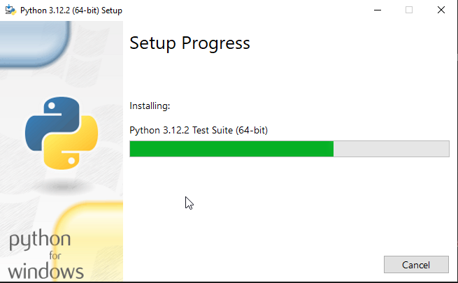
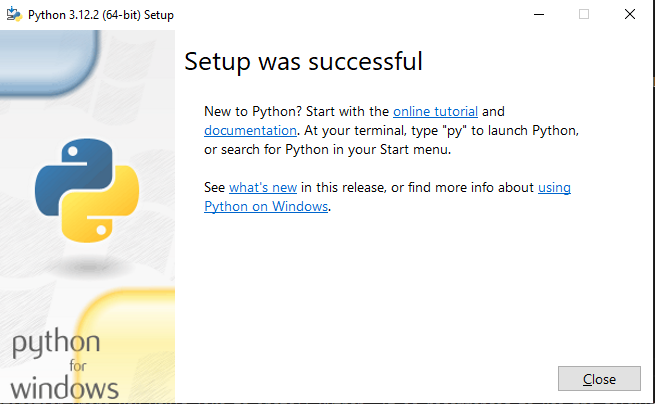

summary: Configure Firebase Hosting
id: configure-firebase-hosting
categories: Firebase
tags: firebase
status: Published
authors: Ariel

# Configure Firebase Hosting

<!-- ------------------------ -->
## Overview

Firebase Hosting provides fast and secure hosting for your web app, static and dynamic content, and microservices. With a single command, you can quickly deploy web apps and serve both static and dynamic content to a global CDN (content delivery network).

### What You Will Learn
- How to configure firebase hosting.

<!-- ------------------------ -->
## Example Web App


<!-- ------------------------ -->
## How to Install Python in Mac Using the PK Installer.

This is probably the easiest way to install python in your Mac computer. To install python, do the following steps:

1. Visit the [downloads](https://www.python.org/downloads/) page of Python.

2. Download the latest (or your desired) version of Python.

3. Open the downloaded `.exe` file and a dialog box will appear like below.

  

4. Tick the `Add python.exe to PATH`, and then click the `Install Now` option.

5. A dialog prompt will appear, then click `Yes` to proceed with the installation progress.

  

6. After few seconds, you will be notified if the setup is successful. Click the `close` button to close the dialog.

  

<!-- ------------------------ -->
## Verify Python is Installed

There are various ways to verify if Python was successfully installed in your `Windows` machine.

Open Windows control panel, Python should be listed as installed software.


You can also execute the command to check the version of Python installed in your machine using `PowerShell` or `Command Prompt`.
```shell
$ python --version
# prints the following
Python 3.10.0
```

<!-- ------------------------ -->
## Conclusion

Congratulations! You have successfully installed `Python` in your machine. Happy coding!!! 
