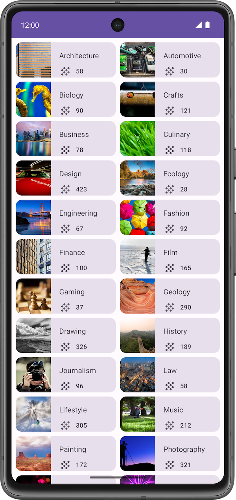

summary: Course List Application
id: course-list-application
categories: Android
tags: android
status: Published
authors: Ariel

# Course List Application

<!-- ------------------------ -->

## Application Overview

Duration: 5

This exercise focuses on creating the components necessary to build a scrollable list. The material expands upon what you learned in the [Affirmation List Application](https://mycodelabs.xyz/codelabs/affirmation-application-list/index.html?index=..%2F..index#0) codelab, and allows you to apply that knowledge to build a scrollable grid.

Some sections might require you to use composables or modifiers, which you may not have seen before. In such cases, see the References available for each problem, where you can find links to documentation related to the modifiers, properties, or composables that you are not familiar with. You can read the documentation and determine how to incorporate the concepts in the app. The ability to understand documentation is an essential skill that you should develop to grow your knowledge.

### Prerequisites

- Complete the Android Basics in Compose coursework through the [Affirmation List Application](https://mycodelabs.xyz/codelabs/affirmation-application-list/index.html?index=..%2F..index#0) codelab.

### What You'll Build

In these practice problems, you will build out the Courses app from scratch. The Courses app displays a list of course topics.

The practice problems are split into sections, where you will build:

- A course topic data class:

The topic data will have an image, a name, and the number of associated courses in that topic.

- A composable to represent a course topic grid item:

Each topic item will display the image, the name, the number of associated courses, and a decorative icon.

- A composable to display a grid of those course topic items.

The final app will look like this:
cour



<!-- ------------------------ -->

## Create Project

Duration: 5

Create a New Project with the Empty Activity template and a minimum SDK of 35.

<!-- ------------------------ -->

## Topic Data Class

Duration: 5

In this section, you build a class to hold the data for each course topic.

Take a look at the items from the final app.


Each course topic holds three pieces of unique information. Using the unique content of each item as a reference, create a class to hold this data.

<!-- ------------------------ -->

## Data Source

Duration: 10

In this section, you create a data set for the grid of courses.

Copy the following items into **app/src/main/res/values/strings.xml**:

```xml
<resources>
  <string name="architecture">Architecture</string>
  <string name="crafts">Crafts</string>
  <string name="business">Business</string>
  <string name="culinary">Culinary</string>
  <string name="design">Design</string>
  <string name="fashion">Fashion</string>
  <string name="film">Film</string>
  <string name="gaming">Gaming</string>
  <string name="drawing">Drawing</string>
  <string name="lifestyle">Lifestyle</string>
  <string name="music">Music</string>
  <string name="painting">Painting</string>
  <string name="photography">Photography</string>
  <string name="tech">Tech</string>
</resources>
```

Provide your own images for each course and import them as drawable in your project then create an empty file called **DataSource.kt**. Copy the following code into the file:

```kotlin
object DataSource {
    val topics = listOf(
        Topic(R.string.architecture, 58, R.drawable.architecture),
        Topic(R.string.crafts, 121, R.drawable.crafts),
        Topic(R.string.business, 78, R.drawable.business),
        Topic(R.string.culinary, 118, R.drawable.culinary),
        Topic(R.string.design, 423, R.drawable.design),
        Topic(R.string.fashion, 92, R.drawable.fashion),
        Topic(R.string.film, 165, R.drawable.film),
        Topic(R.string.gaming, 164, R.drawable.gaming),
        Topic(R.string.drawing, 326, R.drawable.drawing),
        Topic(R.string.lifestyle, 305, R.drawable.lifestyle),
        Topic(R.string.music, 212, R.drawable.music),
        Topic(R.string.painting, 172, R.drawable.painting),
        Topic(R.string.photography, 321, R.drawable.photography),
        Topic(R.string.tech, 118, R.drawable.tech)
    )
}
```

<!-- ------------------------ -->

## Topic Grid Item

Duration: 20

Create a composable to represent a topic grid item.

### Final Screenshot

After you finish the implementation, your topic item layout should match the screenshot below:


### UI Specifications

Use the following UI specifications:


### Text Styling

You can use text [styling property](https://developer.android.com/develop/ui/compose/designsystems/material#text-styles) of the Text composable.

```kotlin
Text(
    text = "Subtitle2 styled",
    // use the text style from the theme typography
    style = MaterialTheme.typography.subtitle2
)
```

**Hint**: Which composable arranges its children vertically and which arranges its children horizontally?

### Adding Image Composable Using Painter Resource

```kotlin
Image(
  painter = painter,
  contentDescription = "Sample Image",
  modifier = Modifier.align(Alignment.Center)
)
```

### References

- [Typography](https://developer.android.com/reference/kotlin/androidx/compose/material/Typography)
- [Standard layout components](https://developer.android.com/develop/ui/compose/layouts/basics#standard-layouts)
- [**Box**](<https://developer.android.com/reference/kotlin/androidx/compose/foundation/layout/package-summary#Box(androidx.compose.ui.Modifier)>) layout
- [**Column**](<https://developer.android.com/reference/kotlin/androidx/compose/foundation/layout/package-summary#Column(androidx.compose.ui.Modifier,androidx.compose.foundation.layout.Arrangement.Vertical,androidx.compose.ui.Alignment.Horizontal,kotlin.Function1)>) layout
- [**Row**](<https://developer.android.com/reference/kotlin/androidx/compose/foundation/layout/package-summary#Row(androidx.compose.ui.Modifier,androidx.compose.foundation.layout.Arrangement.Horizontal,androidx.compose.ui.Alignment.Vertical,kotlin.Function1)>) layout
- [**aspectRatio**](<https://developer.android.com/reference/kotlin/androidx/compose/foundation/layout/package-summary#(androidx.compose.ui.Modifier).aspectRatio(kotlin.Float,kotlin.Boolean)>)
- [**painterResource**](https://developer.android.com/develop/ui/compose/resources#vector-assets)

<!-- ------------------------ -->

## Courses Grid

Duration: 20

Once the topic grid item is created, it can be used to make a grid of course topics.

In this exercise, you use your grid item composable to make a grid with two columns.

### Final Screenshot

After you finish the implementation, your design should match the screenshot below:


### UI Specification

Use the following UI specifications:


### Grid Composable Examples

`LazyVerticalGrid`

```kotlin
LazyVerticalGrid(
  columns = GridCells.Fixed(3), // 3 items per column
  modifier = Modifier.fillMaxSize().padding(8.dp)
) {
  // Generate items
  items(30) { index ->
    Text(item.toString()) // your grid item
  }
}
```

`LazyHorizontalGrid`

```kotlin
LazyHorizontalGrid(
  rows = GridCells.Fixed(3), // 3 items per row horizontally
  modifier = Modifier.fillMaxSize().padding(8.dp)
) {
  // Generate items
  items(20) { item ->
    Text(item.toString()) // your grid item composable
  }
}
```

### References

- [Lists and grids](https://developer.android.com/develop/ui/compose/lists#grids)
- [Fixed grid cells](https://developer.android.com/reference/kotlin/androidx/compose/foundation/lazy/grid/GridCells.Fixed)
- [Lists: Content spacing](https://developer.android.com/develop/ui/compose/lists#content-spacing)
- [Codelab: Affirmation List Application](https://mycodelabs.xyz/codelabs/affirmation-application-list/index.html?index=..%2F..index#0)
