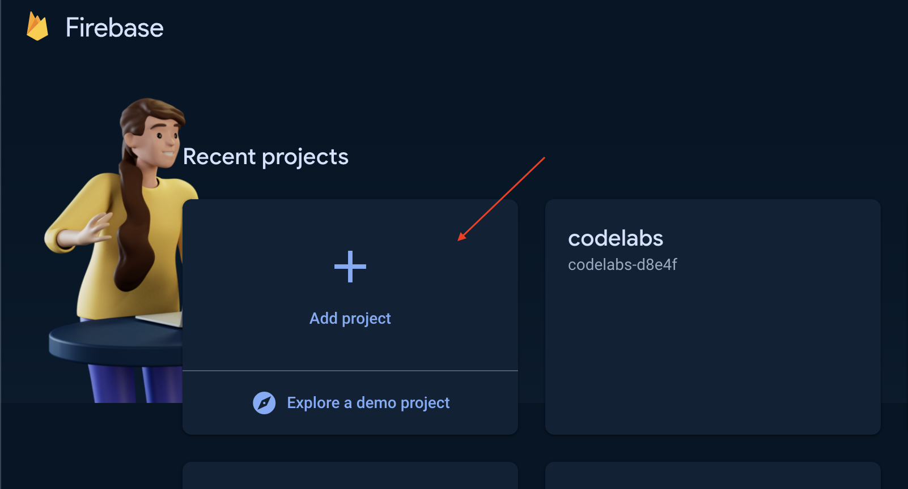
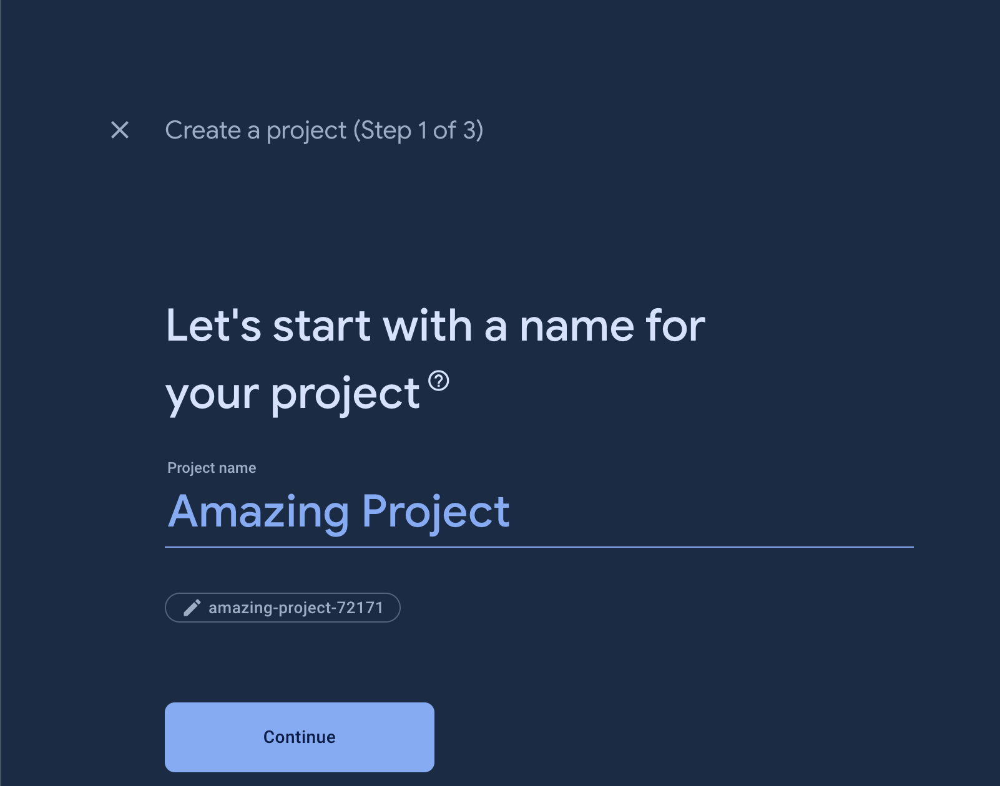
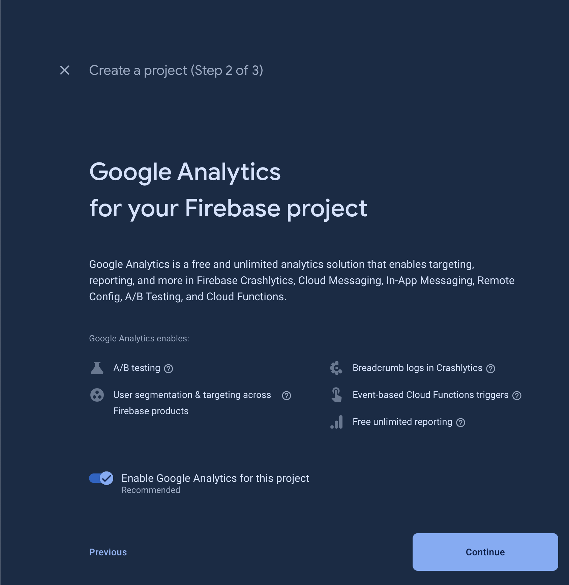
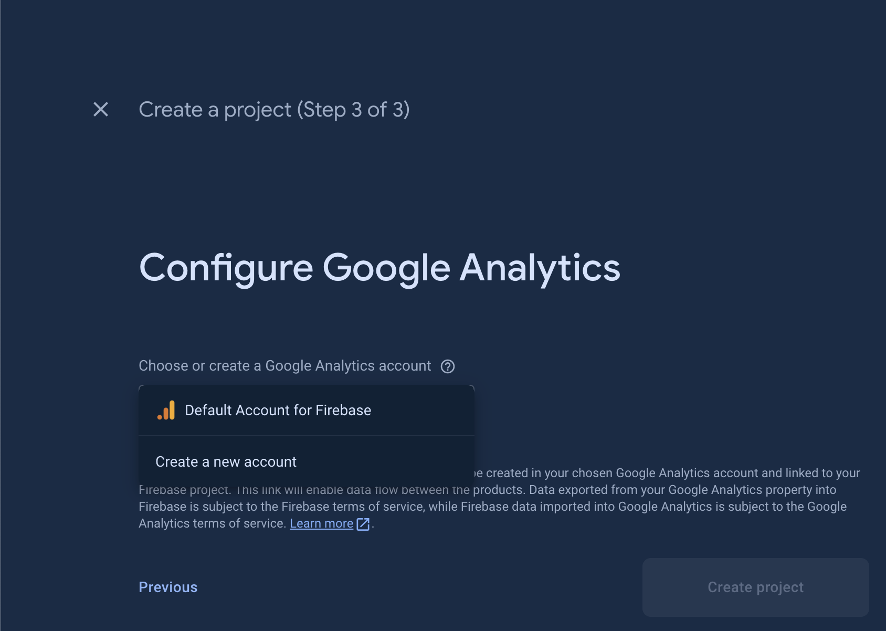
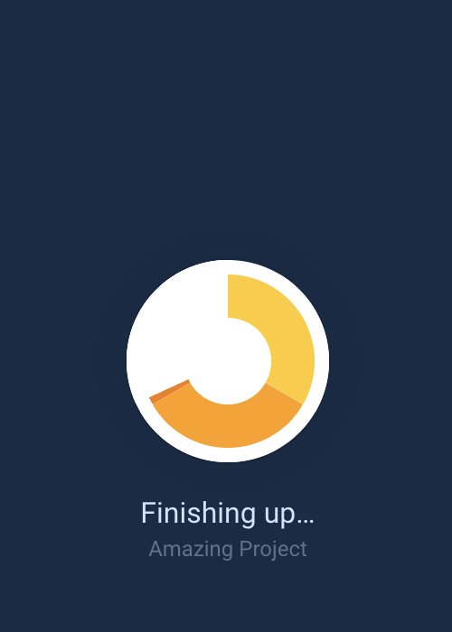
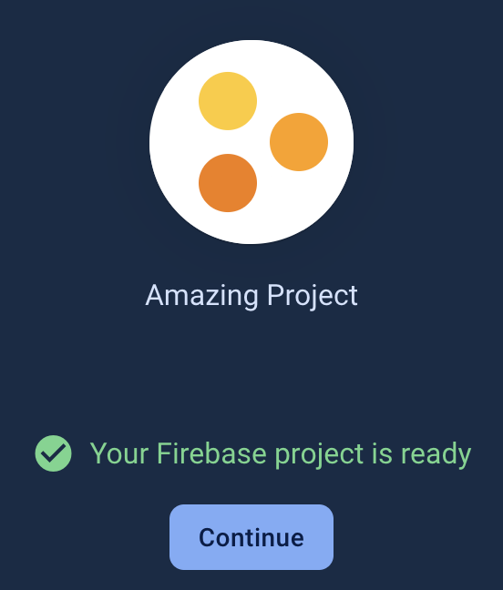
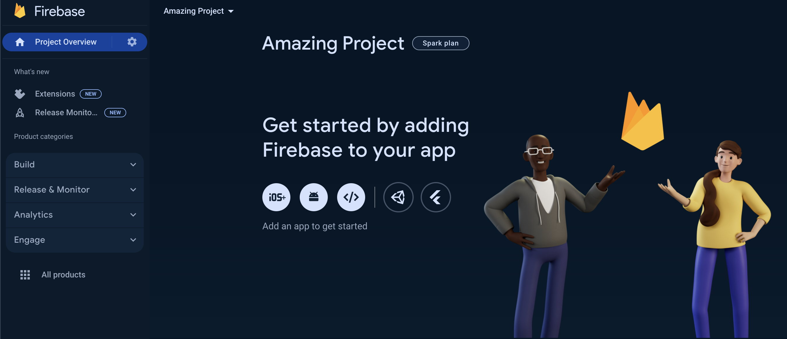

summary: Getting Started with Firebase
id: getting-started-with-firebase
categories: firebase
tags: firebase
status: Published
authors: Ariel

# Getting Started with Firebase

<!-- ------------------------ -->
## Overview
Duration: 1

### What You Will Learn
- What is `Firebase`?
- How to create a `Firebase` project.

<!-- ------------------------ -->
## Firebase
Duration: 2

**Firebase**: **A Streamlined Development Platform from Google**

Firebase is a development platform from Google that streamlines the process of building mobile and web applications. It offers a suite of tools that handle many of the behind-the-scenes tasks, eliminating the need for extensive custom coding. This allows developers to focus their efforts on the core features and functionality that make their app unique.

**In essence, Firebase is a comprehensive backend solution.**

It provides a set of cloud computing services and application development tools. These services encompass databases, authentication, integration features, and more, all readily available for a variety of application development environments. Firebase supports popular platforms like Android, iOS, JavaScript, Node.js, Java, Unity, PHP, and C++.

<!-- ------------------------ -->
## Google Account and Firebase Console
Duration: 5

1. Before you can work on Firebase, it is required that you have a Google account. Therefore [create a google account](https://accounts.google.com/lifecycle/steps/signup/name?ddm=0&dsh=S-401864931:1711723147770055&flowEntry=SignUp&flowName=GlifWebSignIn&theme=mn&TL=AEzbmxxmYEY1EbOHZh_f2KT2PymX9K1o3fQIf1WQXmydI9IgVmmoTkf_gS7roHDF) before proceeding in the next steps.
2. To get started with Firebase, visit the [Firebase console](https://firebase.google.com/).
3. Click `Go to console`.
4. Sign-in with your `Google` account.

<!-- ------------------------ -->
## How to Create Firebase Project
Duration: 10

In order to use the services of `Firebase` in your apps, a project is needed.

1. After `Google` account sign-in, you will redirected to the projects dashboard of `Firebase`.

2. To create a project, click the `Add project` panel.

3. Provide the name of your project then click continue.

4. Keep everything on default and click continue.

5. Select `Create a new account` to create a Google analytics account if you do not have any Google analytics account yet or select `Default Account for Firebase` if available.

6. Click `Create Project` button. Immediately, `Firebase` will do provisioning of your project. Please be patient at this stage because the provisioning might take a few minutes to be accomplished.

7. Once provisioning is done, your project should be ready by now, and click `Continue` to proceed to your project dashboard.

<!-- ------------------------ -->
## Conclusion
Duration: 1

Congratulations! You have successfully created a `Firebase` project, now you are ready to connect `Firebase` to your apps!

