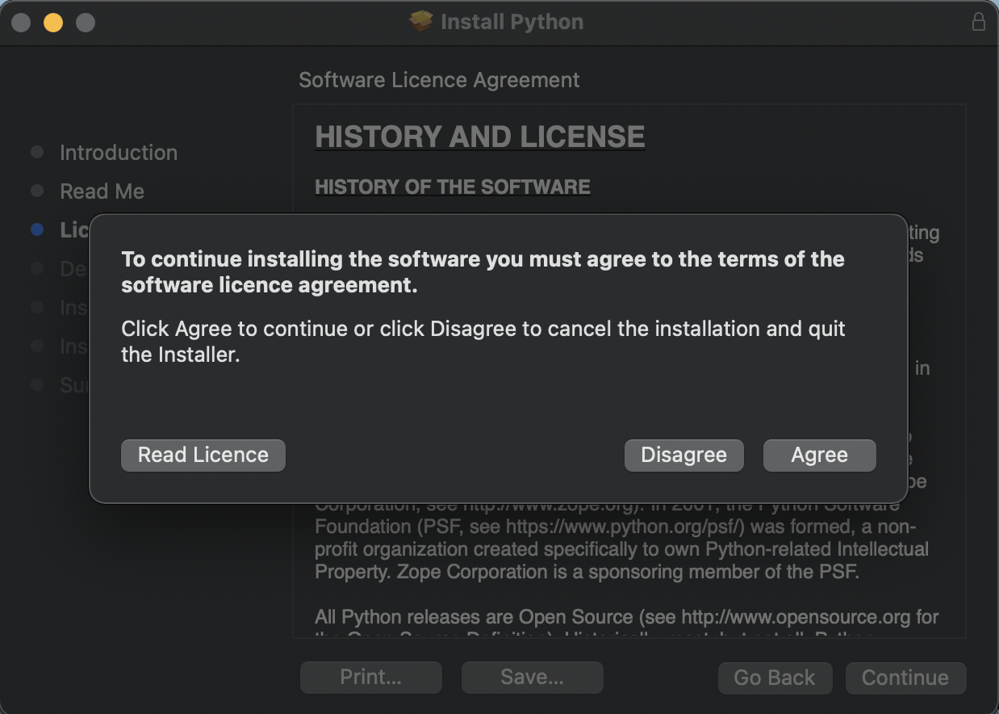

summary: How to Install Python in Mac
id: how-to-install-python-in-mac
categories: Python
tags: python
status: Published
authors: Ariel

# How to Install Python in Mac

<!-- ------------------------ -->
## Overview

### What You Will Learn 
- How to install python in Mac using the pk installer.
- How to install python with Homebrew.

<!-- ------------------------ -->
## How to Install Python in Mac Using the PK Installer.

This is probably the easiest way to install python in your Mac computer. To install python, do the following steps:

1. Visit the [downloads](https://www.python.org/downloads/) page of Python.
2. Download the latest (or your desired) version of Python.
3. Open the downloaded `.pk` file and a dialog box will appear like below.
  
4. Read the important information (Read Me) and continue to the next step.
  
5. Understand the license and click continue.
  
6. Click on agree if you agree with the agreement and conditions.
  
7. Select the destination where you would like to install Python. It is recommended to use the default install destination.
  
8. Installation will commence, and you will get the message below once done.
  

<!-- ------------------------ -->
## How to Install Python with Homebrew

[Homebrew](https://brew.sh), a package manager for Mac, is another way to install Python. This approach is preferred by users who want to install Python from the command line. However, it requires Homebrew to be already up and running on your Mac.

1. Open terminal
2. Update Homebrew
```shell
$ brew update
```
3. Execute install command for Python. This should install Python in your machine without problem.
```shell
$ brew install python
```

<!-- ------------------------ -->
## Verify Python is Installed

There are various ways to verify if Python was successfully installed in your `Mac` machine.

You can use the terminal command `which`, where it will print the `path` of Python in your machine:
```shell
$ which python
# prints the following
$ /usr/local/bin/python
```

You can also execute the command to check the version of Python installed in your machine using the terminal.
```shell
$ python --version
# prints the following
Python 3.10.0
```

<!-- ------------------------ -->
## Conclusion

Congratulations! You have successfully installed `Python` in your machine. Happy coding!!! 
