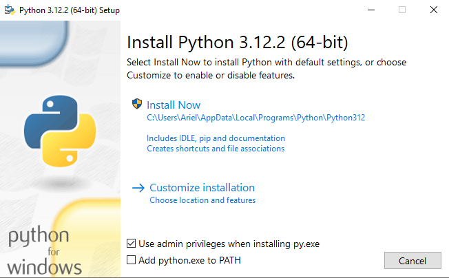

summary: How to Install Python in Windows
id: how-to-install-python-in-windows
categories: Python
tags: python
status: Published
authors: Ariel

# How to Install Python in Windows

<!-- ------------------------ -->
## Overview

### What You Will Learn 
- How to install python in Windows.

<!-- ------------------------ -->
## How to Install Python in Mac Using the PK Installer.

This is probably the easiest way to install python in your Mac computer. To install python, do the following steps:

1. Visit the [downloads](https://www.python.org/downloads/) page of Python.
2. Download the latest (or your desired) version of Python.
3. Open the downloaded `.exe` file and a dialog box will appear like below.
  <p align="center">
    
  </p>
4. Tick the `Add python.exe to PATH` and then click the `Install Now` option.
5. A dialog prompt will appear, then click `Yes` to proceed with the installation progress.
  <p align="center">
    
  </p>
6. After few seconds, you will be notified if the setup is successful. Click `close` to close the dialog.
  <p align="center">
    
  </p>

<!-- ------------------------ -->
## Verify Python is Installed

There are various ways to verify if Python was successfully installed in your `Windows` machine.

Open Windows control panel, Python should be listed as installed software.
<p align="center">
  
</p>

You can also execute the command to check the version of Python installed in your machine using `PowerShell` or `Command Prompt`.
```bash
$ python --version
# prints the following
Python 3.10.0
```

<!-- ------------------------ -->
## Conclusion

Congratulations! You have successfully installed `Python` in your machine. Happy coding!!! 
